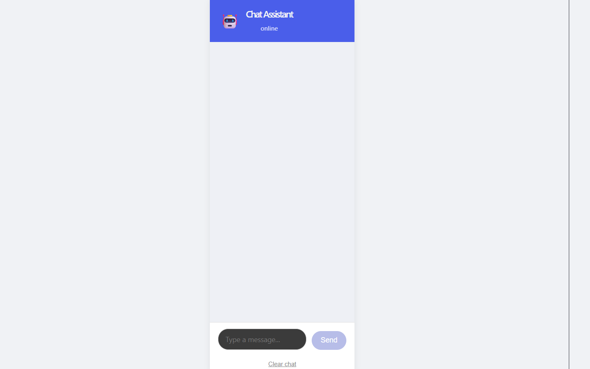
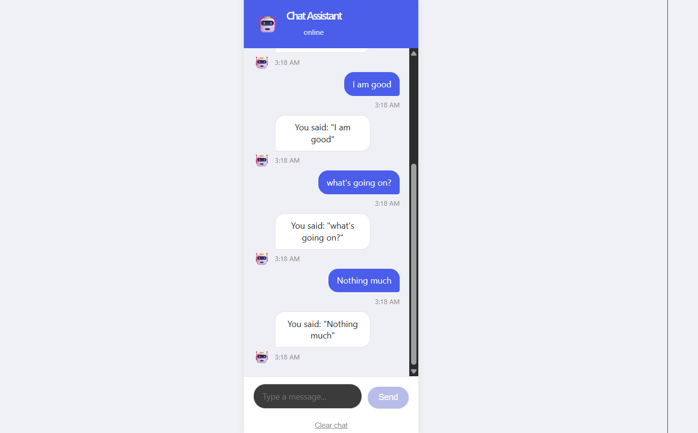

# Chat Interface

A responsive, accessible chat interface built with React and Vite.

**Live demo:** https://chat-interface-sepia-ten.vercel.app/

## Screenshots

### Chat Interface



### Chat Interface with Messages



## Features

- **Layout**: Fixed header, scrollable message area, fixed input bar
- **Messages**: Distinct styling for user vs. bot, bot avatar indicator, hover-for-full-timestamp
- **Input**: Multi-line textarea, Enter to send, Shift+Enter for new line, auto-growing height
- **Auto-scroll**: Scrolls to newest message automatically, pauses if the user scrolls up, resumes when they scroll back down
- **Error handling**: Simulated ~10% failure rate on bot replies, with a Retry button that resends without duplicating messages
- **Persistence**: Chat history saved to and loaded from localStorage, with a Clear chat option
- **Typing indicator**: Animated bouncing dots while the bot is "replying"
- **Accessibility**: Full keyboard navigation, visible focus outlines, `aria-live` region for new messages, `role="log"` on the chat window, descriptive `aria-label`s
- **Responsive**: Full-width layout that adapts down to ~375px mobile widths

## Tech stack

- React 18 (Vite)
- date-fns (timestamp formatting)
- Plain CSS (no framework)

## Getting started

```bash
npm install
npm run dev
```

Open http://localhost:5173

## Implementation notes and assumptions

- Bot replies are **simulated** — there is no real backend. `useChatHistory.js` generates a fake reply after a random 0.8–2s delay, with a ~10% chance of simulated failure, to demonstrate the retry flow.
- Chat history persists in **localStorage** under the key `chat-interface-history`, simulating session persistence without a real backend/database.
- Auto-scroll logic tracks distance from the bottom of the chat window; if the user scrolls more than 100px away from the bottom, new messages no longer force a scroll, until the user manually scrolls back near the bottom.
- Retry re-uses the original failed message's ID and updates it in place, rather than creating a duplicate message.
- State management uses a single custom hook (`useChatHistory`) rather than Redux/Context, since the app's state (messages, typing status) is simple and localized to one screen.
- Layout is full-width by design (not capped/centered), with message bubbles capped at `min(600px, 70%)` so text stays readable on large screens while still using the available space.

## Project structure

```text
src/
  components/
    ChatHeader.jsx
    ChatWindow.jsx
    Message.jsx
    MessageInput.jsx
    TypingIndicator.jsx
  hooks/
    useChatHistory.js
  App.jsx
  App.css
```
